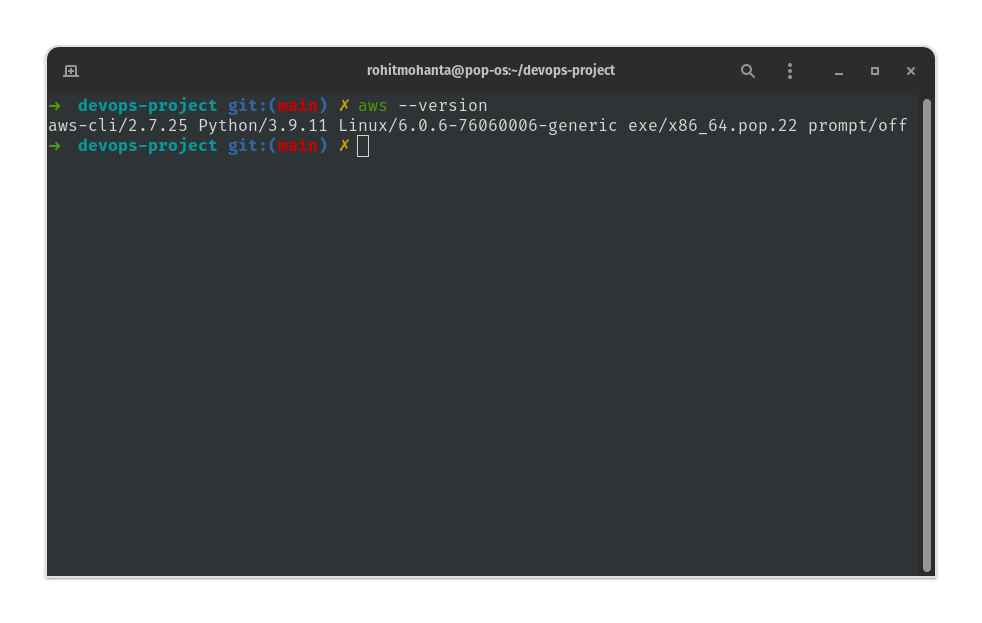

## Sub-task 1

- AWS CLI is installed and configured with full access.



- S3 bucket as Terraform backend. Here is the terraform [config file](Terraform/state.tf).

## Sub-task 2 & Sub-task 3

- This is the file structure of my [terraform codebase](Terraform).

```bash
➜  Terraform git:(main) ✗ tree                    
.
├── main.tf
├── modules
│   ├── nat-gateway
│   │   ├── main.tf
│   │   └── variables.tf
│   ├── security-groups
│   │   ├── main.tf
│   │   ├── outputs.tf
│   │   └── variables.tf
│   └── vpc
│       ├── main.tf
│       ├── outputs.tf
│       └── variables.tf
├── state.tf
├── terraform.tfstate
├── terraform.tfstate.backup
├── terraform.tfvars
└── variables.tf

4 directories, 14 files
```

- I have created modules for nat-gateway, security groups and vpc. Then used those modules to create resources in my `main.tf` config file.
- I am using `variables.tf` in modules for making the code cleaner and flexible. Using `terraform.tfvars` I am providing input for the whole codebase.
- I have used [ec2 instance module](https://www.google.com/url?sa=t&rct=j&q=&esrc=s&source=web&cd=&cad=rja&uact=8&ved=2ahUKEwiG84bVqe_7AhXSXWwGHekTCjEQFnoECAsQAQ&url=https%3A%2F%2Fregistry.terraform.io%2Fmodules%2Fterraform-aws-modules%2Fec2-instance%2Faws%2Flatest&usg=AOvVaw0u15QWuaDDJS7Hi-yEx0Cz) for creating ec2 resources.
- I have set up the S3 bucket as backend to store the state using [state.tf](Terraform/state.tf) config file.
- I have used http://ipv4.icanhazip.com/ API for getting IP to input in security groups accordingly.
- ssh to private EC2 hosts is possible using the Proxy-jump feature. The `jenkins host` and `app host` are being provisioned in a private subnet and the `bastion host` is in public subnet.
- I am using `ssh-config` file to store the information about EC2 hosts.

```
Host bastion-host
HostName 54.89.177.211
User ubuntu
Port 22
IdentityFile ~/.ssh/id_ed25519.pub
IdentitiesOnly yes

Host jenkins-host
HostName 10.0.1.131
User ubuntu
Port 22
IdentityFile ~/.ssh/id_ed25519.pub
IdentitiesOnly yes
ProxyJump bastion-host

Host app-host
HostName 10.0.1.32
User ubuntu
Port 22
IdentityFile ~/.ssh/id_ed25519.pub
IdentitiesOnly yes
ProxyJump bastion-host
```
	After every `terraform apply`, I am just updating the IP addresses.

- I have already authenticated my terminal with `aws cli` using environment variables `AWS_SECRET_ACCESS_KEY` and `AWS_ACCESS_KEY_ID`.
- CIDRs, VPC & Subnet are easily configurable via [terraform.tfvars](Terraform/terraform.tfvars).