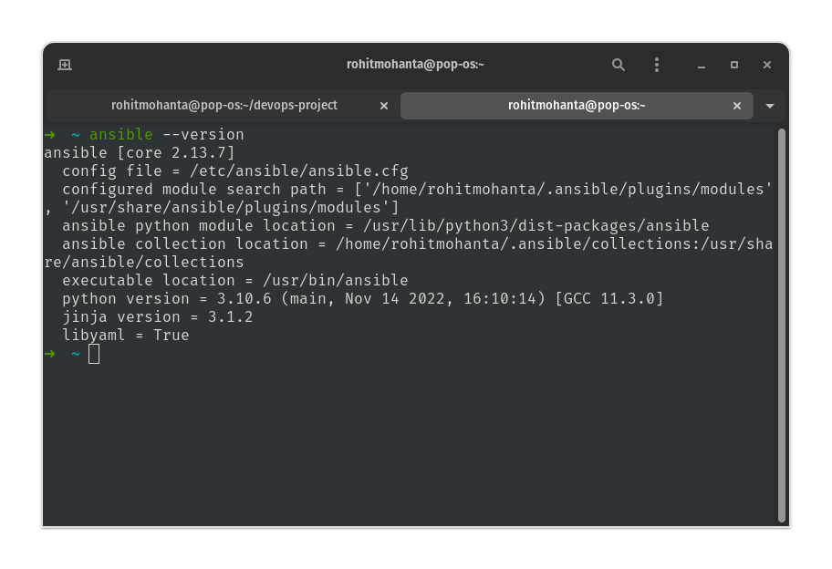
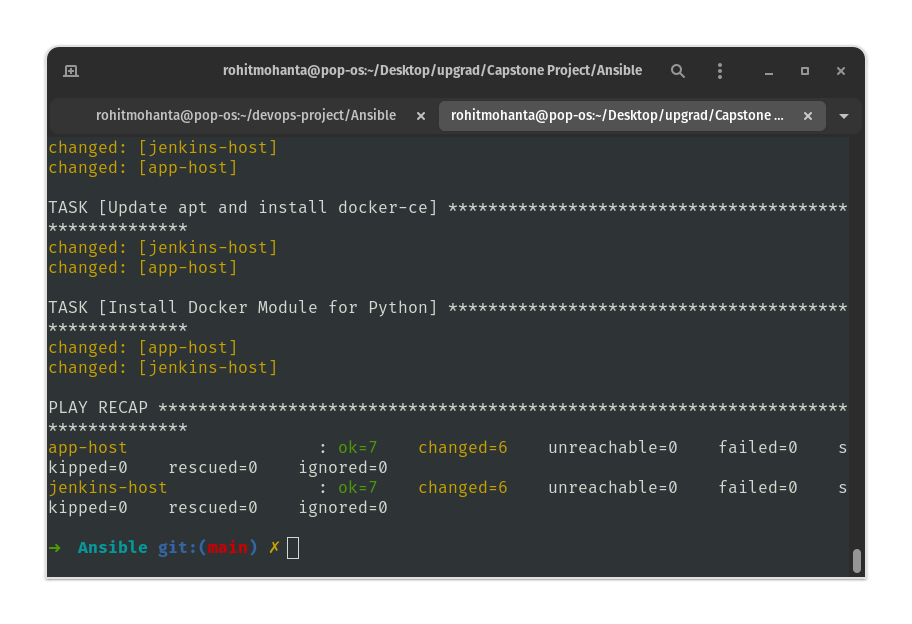
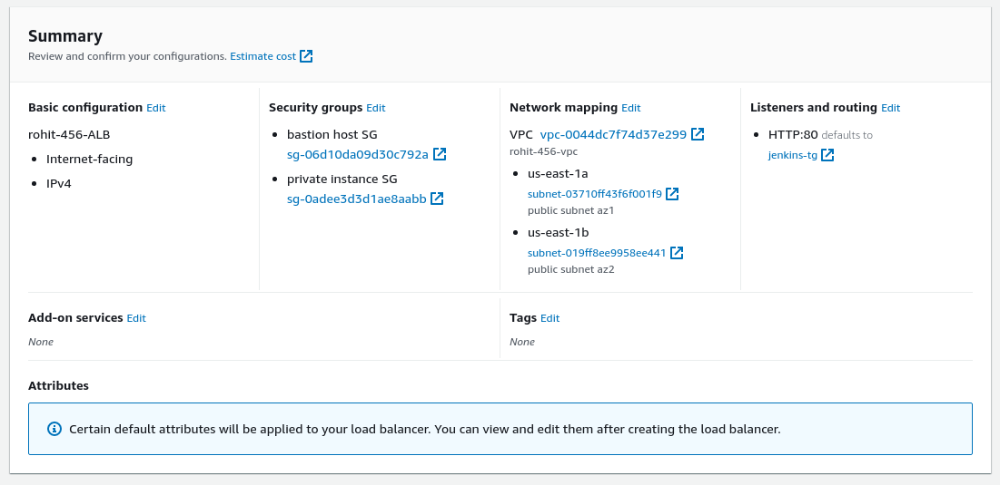
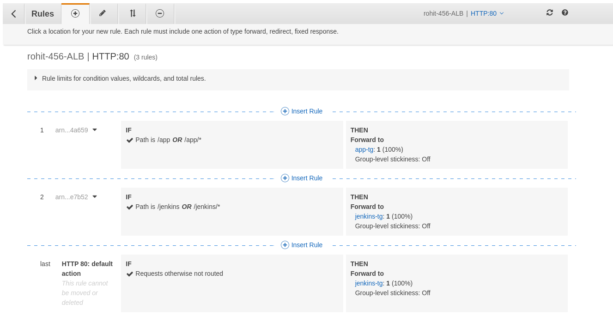
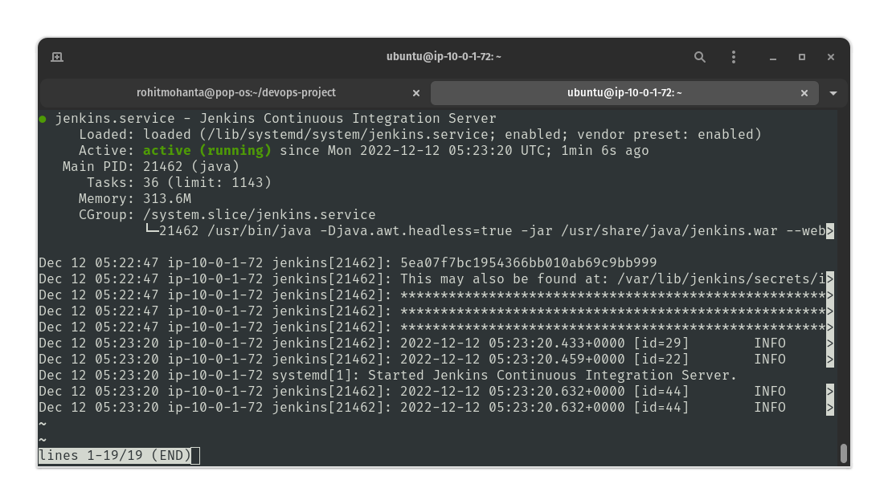
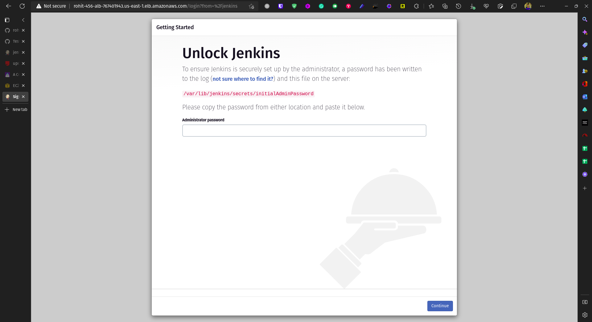
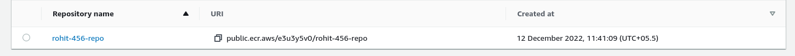
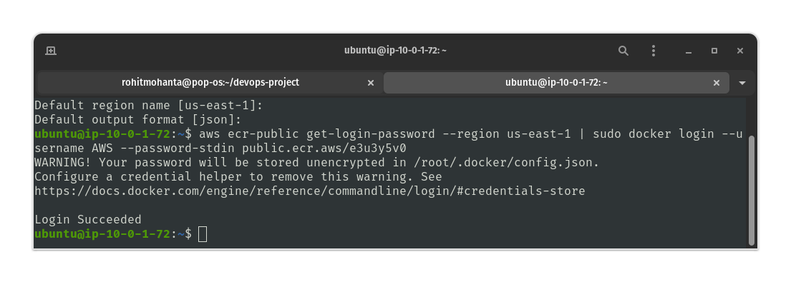
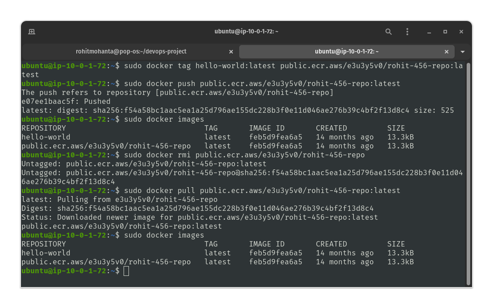

## Sub-task 1

- Ansible is up and running in local system.

- Ansible [inventory file](Ansible/docker-playbook.yml) has just the EC2 host names `jenkins-host` & `app-host` since I have already configured the host names system wide in `~/.ssh/config` file.
- Running `ansible-playbook -i hosts docker-playbook.yml` command will install `docker` on both hosts.
- In case the need to bypass the prompt while ansible is sshing into the hosts, I use `export ANSIBLE_HOST_KEY_CHECKING=False` environment variable.


## Sub-task 2

- First I created two target groups for `jenkins host` and `app host` having `8080` port as backend for both.
- Then I created ALB which listens on port `80` and is `internet facing`.
- By creating and using `rules` inside the ALB, ALB will now forward `/jenkins` and `/jenkins/*` to target group having `jenkins host`.
- Then using another rule, ALB will forward `/app` and `/app/*` to target group having `app host`
- I have used the `bastion host SG` and `private instance SG` while setting up the `ALB`.





## Sub-task 3

- Accessing `jenkins host` via `bastion host` from local system.
- Installing jenkins on `jenkins host` using [jenkins.sh](Jenkins/jenkins.sh) script I have written to automate the installation.

- Accessing it via ALB endpoint `<alb dns>/jenkins` and installing recommended plugins.



## Sub-task 4

- Created ECR repository.


- I am using `AWS CLI` to authenticate `jeknins` and `app` hosts with ECR.

### Steps
- Installing `AWS CLI`

```bash
curl "https://awscli.amazonaws.com/awscli-exe-linux-x86_64.zip" -o "awscliv2.zip" && sudo apt install unzip && unzip awscliv2.zip && sudo ./aws/install
```

- Then `aws configure` to authenticate `aws-cli` with AWS account.
- Authenticating the registry

```bash
aws ecr-public get-login-password --region us-east-1 | sudo docker login --username AWS --password-stdin public.ecr.aws/e3u3y5v0
```

- Now, We can pull and push images to and from our ECR repo.


