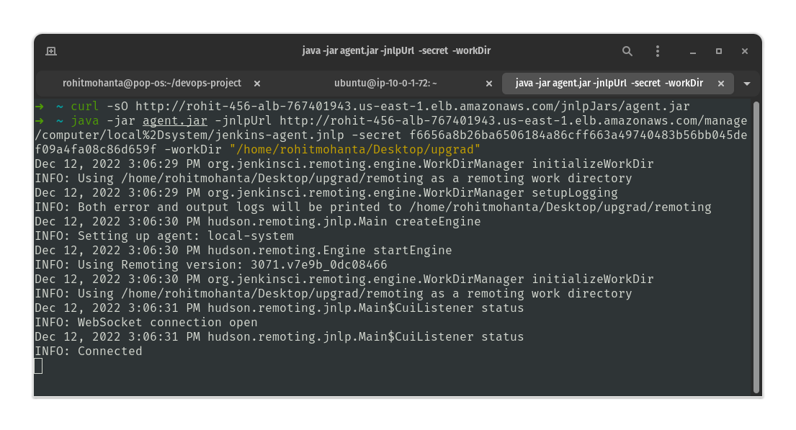
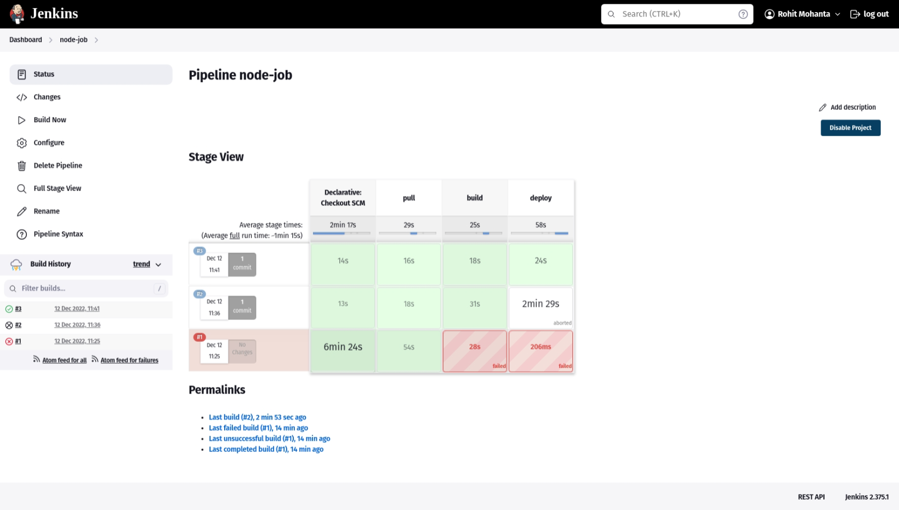
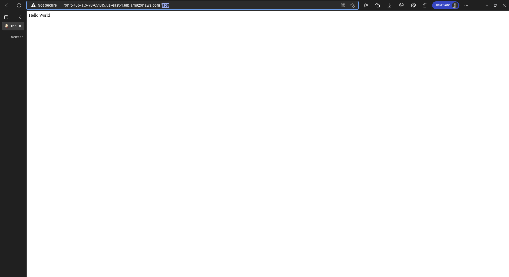

## Sub-task 1

- Created a [GitHub repository](https://github.com/rohit-mohanta/course-project) containing the sample app code.
- Containerised the sample code using this [dockerfile](sample-code/test-nodeapp-1-task/dockerfile) and exposed port 8080.
- Pushed the [dockerfile](sample-code/test-nodeapp-1-task/dockerfile) to [GitHub repository](https://github.com/rohit-mohanta/course-project).

## Sub-task 2 & Sub-task 3

> I couldn't ssh into the `app host` from `jenkins host` to run jenkins jobs.
> So I have used my `local system` as a jenkins agent. And then sshing into `app host` to run the steps.

- Created [jenkinsfile](sample-code/jenkinsfile)
	- Stage 1: git checkout the sample code repository.

```groovy
stage('buildS') {
	steps {
		script {
			sh '''#!/bin/bash
			ssh -o "StrictHostKeyChecking no" app-host << ENDSSH
			cd course-project/test-nodeapp-1-task/
			sudo docker build -f dockerfile -t node-app .
			sudo docker tag node-app:latest public.ecr.aws/e3u3y5v0/course-project:latest
			sudo docker push public.ecr.aws/e3u3y5v0/course-project:latest

ENDSSH
'''
```

- Stage 2: building docker image and pushing it to ECR repo. 
- Stage 3: Checking if older image container is running and stop it, deploying the container to `app host`.


	Jenkins pipeline


	Node app is successfully running on **app host** (`http://rohit-456-alb-937651315.us-east-1.elb.amazonaws.com/app`).